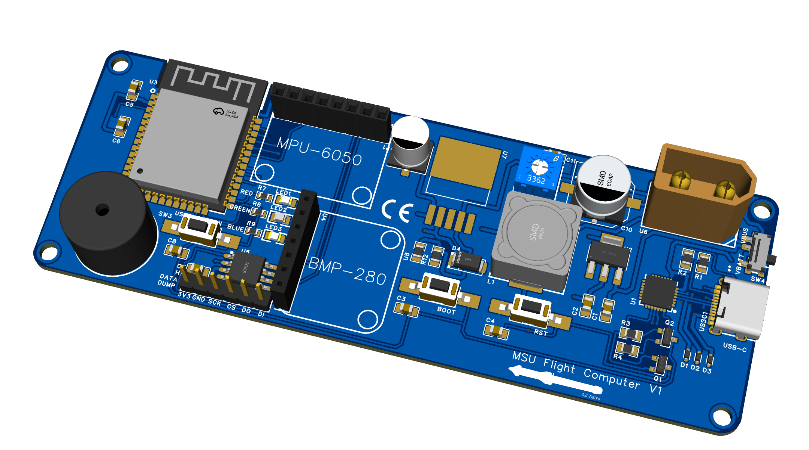
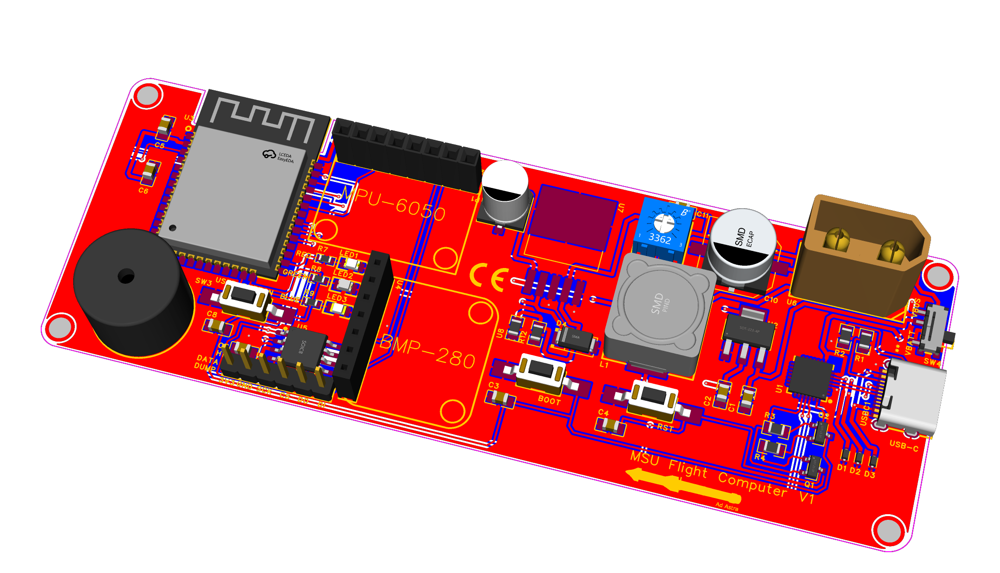

## MSU-avionics
---
## Introduction
---
## Features 
---
## 3D images 
### Version 1
#### Top 3D

#### Top Gerber

### pinouts 
1. https://learn.adafruit.com/adafruit-bmp280-barometric-pressure-plus-temperature-sensor-breakout/pinouts